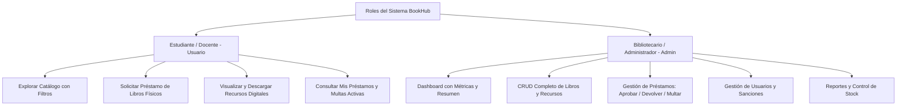

# 📚 BOOKHUB - Sistema de Gestión de Biblioteca Universitaria y Digital

## 1. Información de la Empresa y Justificación
* **Nombre de la Entidad:** Biblioteca Universitaria Central "BookHub".
* **Tipo de Organización:** Institución Educativa Superior / Red de Bibliotecas Académicas.
* **Giro / Actividad:** Gestión del acervo bibliográfico físico y repositorio de recursos de investigación digital para estudiantes, docentes e investigadores.
* **Problema a Solucionar:** La universidad enfrentaba demoras en el control del inventario de libros físicos, pérdida de ejemplares, falta de control en las fechas de devolución y multas, así como la dispersión de documentos digitales de acceso libre (artículos científicos, tesis y guías).
* **Solución Propuesta:** Plataforma web integral **BookHub** que centraliza el catálogo bibliográfico, automatiza la solicitud y control de préstamos físicos y permite la consulta/descarga organizada de recursos digitales.

---

## 2. Definición de Roles y Permisos

### 👤 Rol 1: Estudiante / Docente (Usuario General)
1. **Acceso al Catálogo Público:** Búsqueda rápida por título, autor, categoría, ISBN y disponibilidad física.
2. **Solicitud de Préstamo:** Permite solicitar el préstamo de un ejemplar físico indicando la fecha requerida.
3. **Repositorio Digital:** Visualización de fichas técnicas y descarga de material en formato digital (PDFs/E-books).
4. **Panel Personal ("Mi Cuenta"):**
   - Historial de préstamos solicitados, activos y devueltos.
   - Estado de penalizaciones y recordatorio de fechas límites de entrega.

### 🛡️ Rol 2: Administrador / Bibliotecario (Admin)
1. **Panel de Control (Dashboard):** Vista gráfica con número total de libros, préstamos activos, devoluciones pendientes de hoy y usuarios registrados.
2. **Gestión de Acervo Bibliográfico (CRUD Libros):**
   - Registrar nuevo libro (Título, Autor, Categoría, ISBN, Ejemplares totales, Ejemplares disponibles, Ubicación física, Enlace digital).
   - Editar datos de libros y actualizar stock.
   - Desactivar o eliminar libros del catálogo.
3. **Gestión de Préstamos y Devoluciones:**
   - Registrar salida de libros aprobando solicitudes.
   - Registrar devolución de ejemplares con verificación de estado.
   - Generación automática de alertas/multas en caso de retraso en la devolución.
4. **Gestión de Usuarios:**
   - Visualización de estudiantes registrados.
   - Modificación de estado (Activo, Sancionado, Inactivo).
5. **Gestión de Categorías:**
   - Mantenimiento de categorías temáticas (Ingeniería, Medicina, Humanidades, Ciencias, etc.).

---

## 3. Cronograma de Entregas por Evaluaciones

| Evaluación | Módulo / Entregable | Alcance Técnico |
| :--- | :--- | :--- |
| **Entrega 1 (Diagnóstico y Maquetación)** | • Definición del sistema, roles y funciones (PPT). • Diagrama y especificación de Casos de Uso. • Maqueta UI completa (HTML5 + CSS3 + Bootstrap 5). | Interfaz de Catálogo de Usuario y Panel Administrativo con diseño responsive. |
| **Entrega 2 (Modelo y Persistencia)** | • Diagrama de Clases (MVC + DAO). • Modelo Entidad-Relación y Base de Datos SQL funcional. • Creación de JavaBeans (POJOs) y capa DAO con JDBC. | Conexión a Base de Datos MySQL/PostgreSQL y pruebas de consulta. |
| **Entrega 3 (Controladores y CRUD Admin)** | • Implementación de Servlets (`HttpServletRequest`, `HttpServletResponse`). • CRUD completo de Libros y Categorías con JSP + JSTL. • Control de sesiones y autenticación de usuarios. | Módulos funcionales del rol Administrador y control de accesos. |
| **Entrega 4 (Evaluación Final Integrada)** | • Módulo de Préstamos y Devoluciones funcional. • Panel de Usuario final integrado. • Validaciones completas, control de excepciones y reporte final. | Sistema 100% operativo bajo arquitectura Java Web. |
