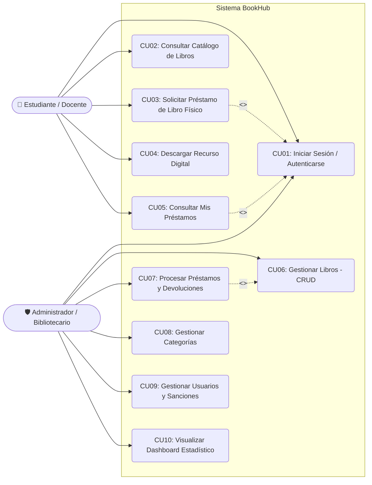

# 📑 Diagrama y Especificación de Casos de Uso - BOOKHUB

## 1. Diagrama General de Casos de Uso (UML)

---

## 2. Especificación Detallada de Casos de Uso Clave

### 📄 CU03: Solicitar Préstamo de Libro Físico
* **Actor Principal:** Estudiante / Docente (Usuario autenticado).
* **Precondiciones:**
  1. El usuario debe haber iniciado sesión en el sistema.
  2. El libro seleccionado debe contar con stock disponible (`stock_disponible > 0`).
  3. El usuario no debe poseer sanciones o multas activas.
* **Flujo Principal:**
  1. El usuario navega en el catálogo de libros o busca por título/autor.
  2. El usuario selecciona un libro y presiona el botón "Solicitar Préstamo".
  3. El sistema muestra un modal con los detalles del libro y permite seleccionar la fecha tentativa de devolución (máximo 7 días hábiles).
  4. El usuario confirma la solicitud.
  5. El sistema valida la disponibilidad del ejemplar y el estado del usuario.
  6. El sistema crea el registro del préstamo en estado `SOLICITADO` y descuenta 1 unidad temporal de disponibilidad.
  7. El sistema muestra un mensaje de confirmación con el código de solicitud generado.
* **Flujo Alternativo (Stock Agotado):**
  * En el paso 5, si no hay ejemplares disponibles, el sistema deshabilita la opción e informa que el libro se encuentra prestado en su totalidad.
* **Flujo Alternativo (Usuario con Sanción):**
  * En el paso 5, si el usuario tiene una sanción vigente por retraso previo, el sistema bloquea la solicitud y notifica que debe regularizar su estado.
* **Postcondiciones:** Se crea una nueva solicitud de préstamo asociada al usuario y al libro.

---

### 📄 CU06: Gestionar Libros (CRUD)
* **Actor Principal:** Administrador / Bibliotecario.
* **Precondiciones:** El administrador debe contar con una sesión activa con rol `ADMIN`.
* **Flujo Principal:**
  1. El administrador ingresa a la opción "Gestión de Libros" en el menú lateral.
  2. El sistema lista todos los libros existentes en una tabla con opciones de paginación, búsqueda, edición y eliminación.
  3. **Creación:** El admin presiona "Nuevo Libro", completa los campos requeridos (Título, Autor, Editorial, Año, Categoría, ISBN, Stock Total, Ubicación, Enlace PDF opcional) y presiona "Guardar".
  4. El sistema valida los datos y registra el libro en la base de datos.
  5. **Modificación:** El admin presiona "Editar", actualiza la información y guarda los cambios.
  6. **Eliminación / Desactivación:** El admin presiona "Eliminar", confirma en el modal y el sistema actualiza el estado del libro.
* **Postcondiciones:** La base de datos queda actualizada y la tabla se recarga con los datos vigentes.

---

### 📄 CU07: Procesar Préstamos y Devoluciones
* **Actor Principal:** Administrador / Bibliotecario.
* **Precondiciones:** Existencia de registros de préstamos en estado `SOLICITADO` o `EN_PRESTAMO`.
* **Flujo Principal:**
  1. El bibliotecario ingresa al módulo de "Gestión de Préstamos".
  2. Visualiza las solicitudes pendientes con datos del estudiante y el libro físico.
  3. **Entrega de Libro:** El bibliotecario entrega el libro físicamente y presiona "Aprobar Entrega", cambiando el estado a `EN_PRESTAMO` y fijando la fecha límite.
  4. **Recepción / Devolución:** Cuando el estudiante devuelve el ejemplar, el bibliotecario busca el préstamo y presiona "Registrar Devolución".
  5. El sistema verifica si la fecha de devolución es posterior a la fecha límite:
     - Si está a tiempo: cambia el estado a `DEVUELTO` e incrementa el stock disponible del libro.
     - Si está fuera de plazo: cambia el estado a `DEVUELTO_CON_RETRASO`, repone el stock y genera automáticamente una penalización/multa.
* **Postcondiciones:** El stock físico se actualiza y el historial del estudiante queda registrado.
