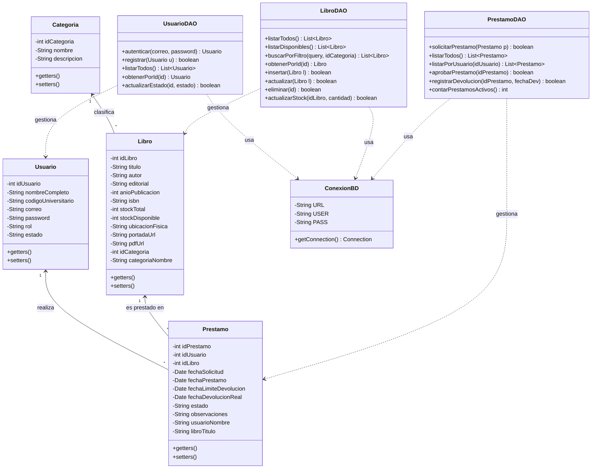
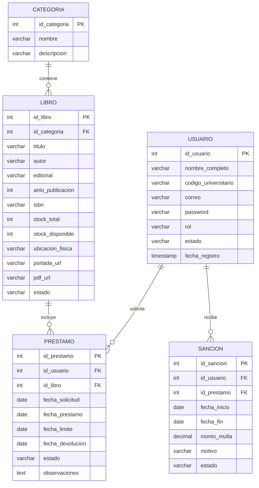

# 🏛️ Diagrama de Clases, Modelo de Datos y Arquitectura - BOOKHUB

## 1. Arquitectura del Sistema (Patrón MVC + DAO en Java)

El sistema implementa la arquitectura Modelo-Vista-Controlador (MVC) utilizando Servlets para el control, JSPs para las vistas, JavaBeans para la representación de entidades y DAOs con JDBC para la persistencia de datos.

```
       [ Cliente / Navegador ]
                 │
                 ▼ (HTTP GET / POST)
       ┌────────────────────┐
       │   Controladores    │  <-- Servlets (LoginServlet, LibroServlet, etc.)
       └─────────┬──────────┘
                 │
        ┌────────┴────────┐
        ▼                 ▼
 ┌───────────────┐ ┌────────────────┐
 │    Vistas     │ │     Modelo     │
 │  (JSP + JSTL  │ │  (JavaBeans    │
 │ + Bootstrap)  │ │   + DAOs)      │
 └───────────────┘ └────────┬───────┘
                            │ (JDBC)
                            ▼
                   [ Base de Datos SQL ]
```

---

## 2. Diagrama de Clases UML (Java)



---

## 3. Modelo Entidad - Relación (MER)


